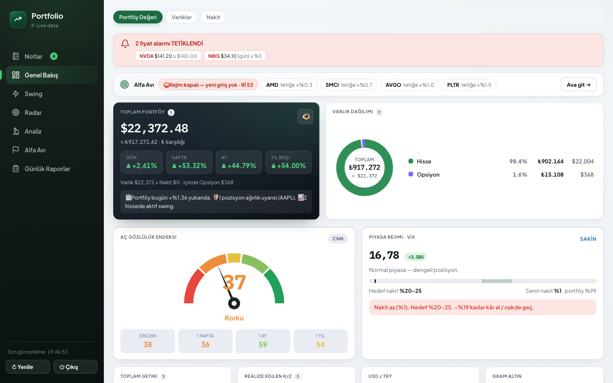
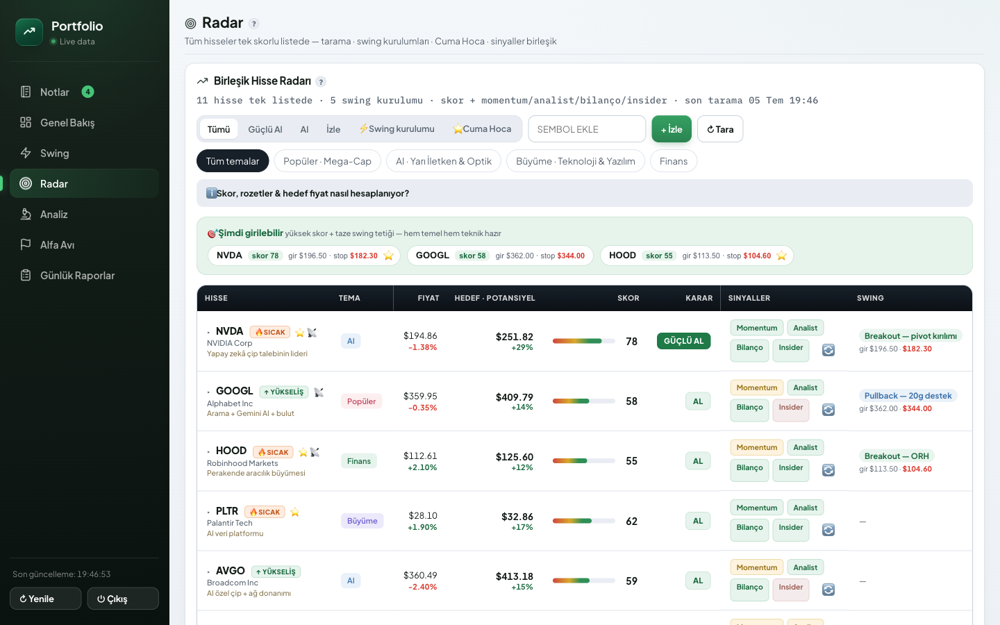
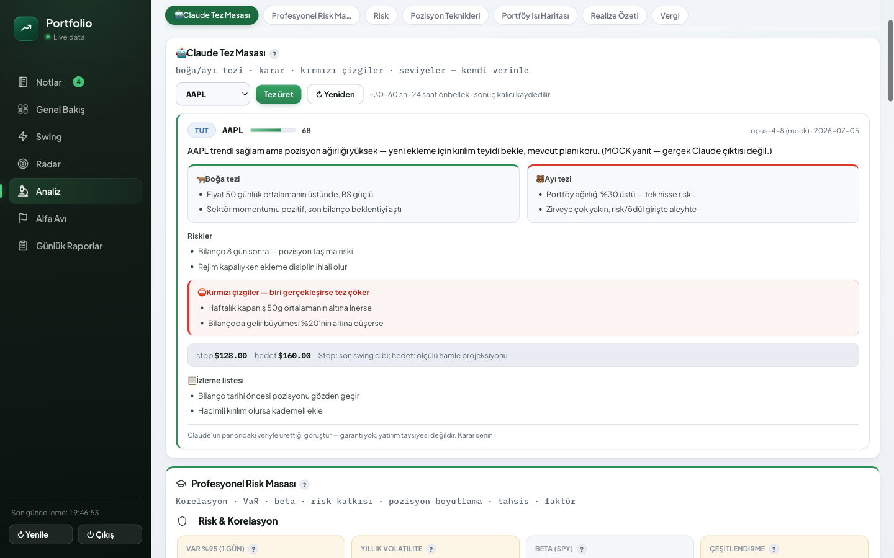
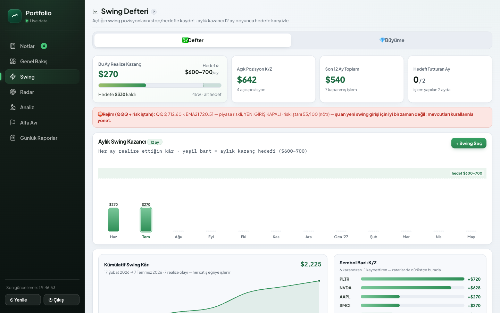
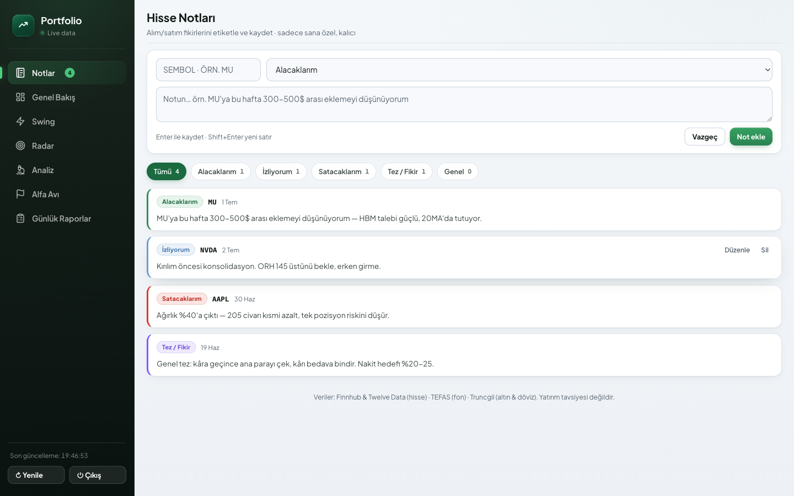

# Portfolio Tracker

**Self-hosted stock portfolio & swing-trading discipline dashboard** — built end-to-end as a solo project: product, design, backend, data pipelines and AI integration.

Vanilla JavaScript SPA · Express · PostgreSQL · Claude API · MCP




> **Why it exists** — I wanted one place that enforces my own trading discipline instead of just charting prices: *Rule #1: don't lose money.* Positions without a stop plan get flagged, new entries are blocked when the market regime is off, profits trigger "pull your initial capital, let the profit ride for free" suggestions. The app is my daily driver; the UI is Turkish because it was built for me first.

---

## Features

**Portfolio core**
- Live portfolio (US stocks, funds, gold, options) with day/week/month/YTD returns, allocation donut, benchmark compare and a privacy mode that masks every number
- Price alerts, transaction ledger with realized P/L, TL/USD dual accounting, tax view
- **Notes** — a labeled journal (*to buy / watching / to sell / thesis*) so every trade idea leaves a paper trail

**Discipline engine**
- **Swing journal** with stop/target per trade, monthly realized-profit target tracked across a 12-month bar chart
- **Zero-cost growth tracker** — effective cost = cost − realized profit per symbol; positions you fully de-risked are marked 🎁 free-riding
- **Radar** — one unified 0–100 score per ticker (momentum ≈30% · analyst consensus ≈25% · fundamentals ≈30% · insider activity ≈15%), Qullamaggie-style setup detection (breakout / pullback with entry-stop-target), a transparent model target price, and a market-regime gate (QQQ vs EMA21 + a composite risk-appetite index) that blocks new entries in bad tape
- **Guardian** — hourly server-side checks that e-mail me when a stop is breached, a position grows past concentration limits, or a profit spike makes a zero-cost exit possible
- **Daily trade audit** — a deterministic rule engine grades every trade of the day (*correct / debatable / wrong*) with evidence bullets
- **Alpha Hunt** — an AI paper-trading challenge ($1.5k → $2.5k) running my swing rules against the live universe, with an append-only ledger so past decisions can't be quietly rewritten

**Risk desk**
- Correlation matrix, 95% VaR, portfolio beta, per-position risk contribution, factor exposure, risk-based position sizing, core/satellite rebalancing hints
- Net-worth history with a 6-month Monte-Carlo forecast band (geometric Brownian motion, analytic quantiles)

**Claude AI layer** *(optional — activates when `ANTHROPIC_API_KEY` is set)*
- **Thesis Desk** — pick a position and Claude writes an adversarial investment thesis *grounded only in the app's own data* (live quote, technical analysis, my notes, earnings calendar, news): bull case vs bear case, a forced decision (ADD / HOLD / TRIM / GRAY-ZONE) with confidence, measurable red lines that would kill the thesis, stop/target levels and a watch checklist. Structured outputs (`json_schema`) — the UI never parses free text. Cached 24h per symbol, persisted as an audit trail.
- **Day Audit** — the rule engine's findings are sent to Claude as an evidence pack; it returns a process-focused review (discipline score, per-trade verdict + lesson, "tomorrow's rule"), stored per date. Deterministic engine first, LLM second: cheap, grounded, auditable.
- **MCP server** — `scripts/mcp-portfoy.js` exposes the whole API to Claude Code / Claude Desktop as 6 tools (`portfoy_ozet`, `pozisyon_detay`, `notlar`, `not_ekle`, `radar_tara`, `risk_ozet`), so you can literally ask *"how is my MU position doing and what did I write about it?"* from your editor.

| Radar | Thesis Desk (Claude) |
|---|---|
|  |  |

| Swing journal | Notes |
|---|---|
|  |  |

---

## Architecture

```
Browser ── vanilla JS SPA (no framework, no build step — public/)
   │
   ▼
Express (server.js)
   ├── market data: Finnhub + Twelve Data (+ Yahoo fallback locally)
   │     └── TTL caches: candles · quotes · news · earnings  → free-tier friendly
   ├── engines: radar scoring · QM setup detection (qm.js) · guardian · day audit
   ├── Claude API (@anthropic-ai/sdk) — adaptive thinking + json_schema outputs
   ├── persistence: single JSON document → PostgreSQL (DATABASE_URL)
   │                                        └─ file fallback for local dev
   └── auth: salted-hash password + signed cookie (open mode if unset)

scripts/mcp-portfoy.js ── stdio MCP server → Claude Code / Desktop
scripts/mock-swing-server.js ── full-app mock for dev & UI testing
```

**Engineering choices I'd defend in a review**
- **No frontend framework, no build step.** One hand-rolled SPA talking to one Express file. For a single-user tool, the absence of tooling *is* the feature: instant deploys, zero dependency churn, 3 runtime deps total (`express`, `pg`, `@anthropic-ai/sdk`).
- **Deterministic first, LLM second.** The rule engine produces the evidence; Claude interprets it. AI output is schema-constrained, cached, persisted and feature-flagged — if the key is missing the panels hide themselves and nothing else breaks.
- **Provider-agnostic data layer.** Every external call goes through a TTL cache sized to free-tier quotas; the app stays fully usable when a provider throttles (stale-but-shown beats blank).
- **Honest measurement.** The paper-trading ledger is append-only, the day audit stores its inputs alongside the verdict, and realized P/L can be overridden with broker ground truth — the app is designed to prevent me from lying to myself.
- **Dev/prod parity via a mock.** `scripts/mock-swing-server.js` serves the real SPA with realistic fake data and stubbed AI endpoints, so UI work never touches production data.

---

## Getting started

```bash
git clone https://github.com/KaanCan1/portfolio-tracker.git
cd portfolio-tracker
npm install
node server.js          # → http://localhost:3000
```

Runs out of the box with the demo portfolio in `portfolio.json` — no keys, no database, no password (open mode).

**Add keys as you need them** (`cp .env.example .env`):

| Variable | Enables | Free tier |
|---|---|---|
| `FINNHUB_API_KEY` | live quotes, fundamentals, analyst & insider data, news, earnings calendar | ✅ |
| `TWELVEDATA_API_KEY` | daily candles → radar scoring, QM setups, charts | ✅ |
| `DATABASE_URL` | persistent storage (any Postgres; Supabase session pooler recommended) | ✅ |
| `AUTH_PASSWORD` + `AUTH_SECRET` | login gate + signed sessions | — |
| `ANTHROPIC_API_KEY` | Claude Thesis Desk + Day Audit (`AI_MODEL` to override the default `claude-opus-4-8`) | paid |
| `RESEND_API_KEY` (+ `NOTIFY_EMAIL`) | guardian e-mail alerts | ✅ |

**Deploy** — `render.yaml` is a ready Render blueprint (free plan): set the env vars above, attach a free Supabase Postgres via `DATABASE_URL` (Render's free disk is ephemeral), and point an uptime pinger at `/healthz` so the instance never spins down.

**MCP** — register the server in your Claude Code project (`.mcp.json`):

```json
{
  "mcpServers": {
    "portfoy": {
      "command": "node",
      "args": ["scripts/mcp-portfoy.js"],
      "env": { "PORTFOY_URL": "https://your-app.onrender.com", "PORTFOY_PASSWORD": "${PORTFOY_PASSWORD}" }
    }
  }
}
```

---

## Privacy & data

This public repository contains **code and demo data only**. My real deployment keeps portfolio data in Postgres and every secret in environment variables — none of it is in this repo or its history (the repo was published as a clean single-commit snapshot for exactly that reason).

## Disclaimer

Personal project. Nothing here is investment advice; the AI features explicitly say so in-app, and the scoring/target models are transparent heuristics, not predictions. Use at your own risk.

## License

[MIT](LICENSE) © 2026 Kaan Can Kurt
