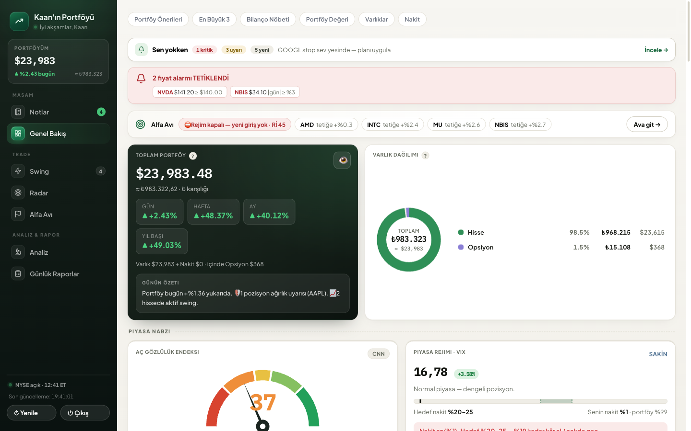
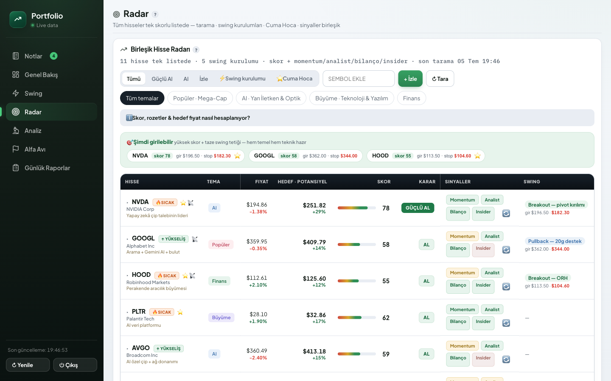
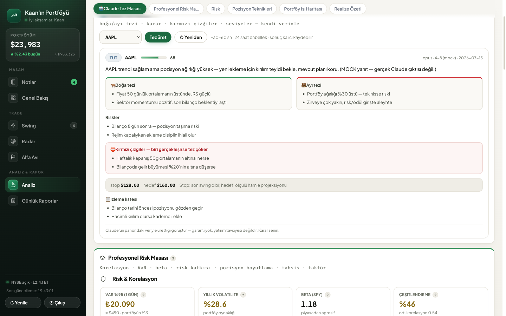
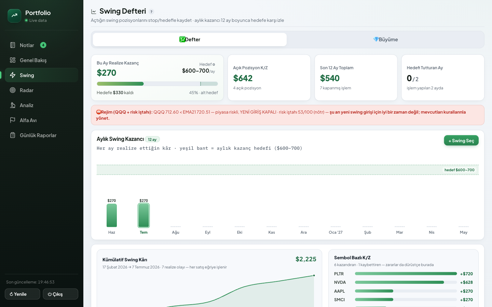
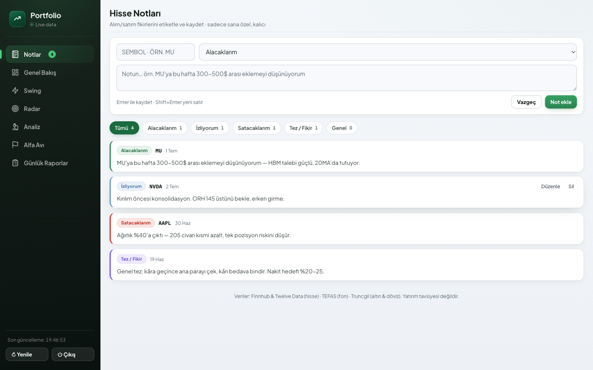
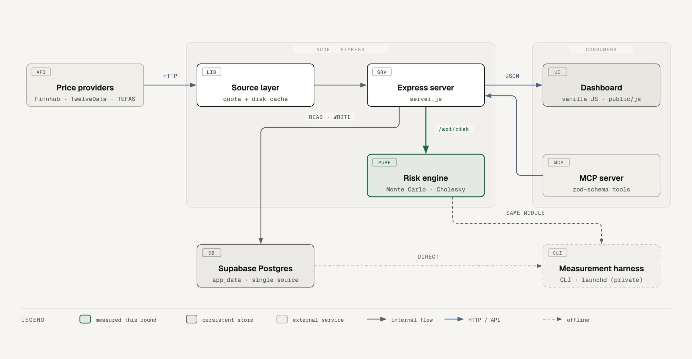
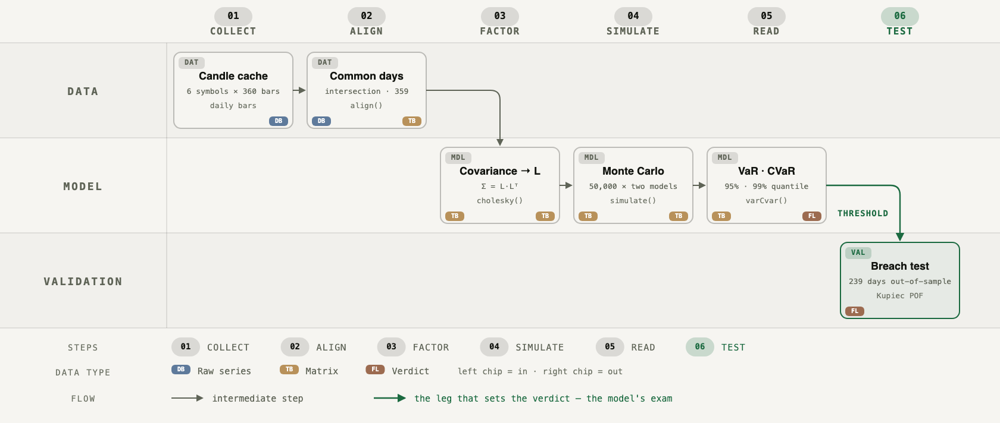

# Portfolio Tracker

**Self-hosted stock portfolio & swing-trading discipline dashboard** — built end-to-end as a solo project: product, design, backend, data pipelines and AI integration.

Vanilla JavaScript SPA · Express · PostgreSQL · Claude API · MCP




> **Why it exists** — I wanted one place that enforces my own trading discipline instead of just charting prices: *Rule #1: don't lose money.* Positions without a stop plan get flagged, new entries are blocked when the market regime is off, profits trigger "pull your initial capital, let the profit ride for free" suggestions. The app is my daily driver; the UI is Turkish because it was built for me first.

---

## Features

**Portfolio core**
- Live portfolio (US stocks, funds, gold, options) with day/week/month/YTD returns, allocation donut, benchmark compare and a privacy mode that masks every number
- Price alerts, transaction ledger with realized P/L, TL/USD dual accounting, tax view
- **Notes** — a labeled journal (*to buy / watching / to sell / thesis*) so every trade idea leaves a paper trail

**Discipline engine**
- **Swing journal** with stop/target per trade, monthly realized-profit target tracked across a 12-month bar chart
- **Zero-cost growth tracker** — effective cost = cost − realized profit per symbol; positions you fully de-risked are marked 🎁 free-riding
- **Radar** — one unified 0–100 score per ticker (momentum ≈30% · analyst consensus ≈25% · fundamentals ≈30% · insider activity ≈15%), Qullamaggie-style setup detection (breakout / pullback with entry-stop-target), a transparent model target price, and a market-regime gate (QQQ vs EMA21 + a composite risk-appetite index) that blocks new entries in bad tape
- **Guardian** — hourly server-side checks that e-mail me when a stop is breached, a position grows past concentration limits, or a profit spike makes a zero-cost exit possible
- **Daily trade audit** — a deterministic rule engine grades every trade of the day (*correct / debatable / wrong*) with evidence bullets
- **Alpha Hunt** — an AI paper-trading challenge ($1.5k → $2.5k) running my swing rules against the live universe, with an append-only ledger so past decisions can't be quietly rewritten

**Risk desk**
- Correlation matrix, 95% VaR, portfolio beta, per-position risk contribution, factor exposure, risk-based position sizing, core/satellite rebalancing hints
- Net-worth history with a 6-month Monte-Carlo forecast band (geometric Brownian motion, analytic quantiles)

**Claude AI layer** *(optional — activates when `ANTHROPIC_API_KEY` is set)*
- **Thesis Desk** — pick a position and Claude writes an adversarial investment thesis *grounded only in the app's own data* (live quote, technical analysis, my notes, earnings calendar, news): bull case vs bear case, a forced decision (ADD / HOLD / TRIM / GRAY-ZONE) with confidence, measurable red lines that would kill the thesis, stop/target levels and a watch checklist. Structured outputs (`json_schema`) — the UI never parses free text. Cached 24h per symbol, persisted as an audit trail.
- **Day Audit** — the rule engine's findings are sent to Claude as an evidence pack; it returns a process-focused review (discipline score, per-trade verdict + lesson, "tomorrow's rule"), stored per date. Deterministic engine first, LLM second: cheap, grounded, auditable.
- **MCP server** — `scripts/mcp-portfoy.js` exposes the whole API to Claude Code / Claude Desktop as 6 tools (`portfoy_ozet`, `pozisyon_detay`, `notlar`, `not_ekle`, `radar_tara`, `risk_ozet`), so you can literally ask *"how is my MU position doing and what did I write about it?"* from your editor.

| Radar | Thesis Desk (Claude) |
|---|---|
|  |  |

| Swing journal | Notes |
|---|---|
|  |  |

---

## Architecture

<picture>
  <source media="(prefers-color-scheme: dark)" srcset="docs/diagrams/architecture-dark.png">
  
</picture>

> Vector source: [`docs/diagrams/architecture.html`](docs/diagrams/architecture.html)
> — one self-contained HTML file with inline SVG ([dark](docs/diagrams/architecture-dark.html)).
> How the diagrams are built, how their palette maps to the dashboard's own CSS
> variables, and two dark-mode rules found by measuring:
> [`docs/diagrams/README.md`](docs/diagrams/README.md).

The dashed arrow on the right is deliberate: the measurement harness reads the **store directly** and reuses the risk engine's *same* pure module. That is what keeps the number on the dashboard and the number in a measurement from drifting apart — if a metric had two implementations, one of them would eventually be wrong.

What the diagram leaves out, for node-budget reasons:

- **Engines inside Express** — radar scoring, Qullamaggie setup detection (`qm.js`), guardian checks, daily trade audit
- **Claude layer** — called from the server with `json_schema` structured outputs, cached 24h and persisted as an audit trail
- **Auth** — salted-hash password + signed cookie; open mode when unset
- **Dev/prod parity** — `scripts/mock-swing-server.js` serves the real SPA against realistic fake data and stubbed AI endpoints

**Engineering choices I'd defend in a review**
- **No frontend framework, no build step.** One hand-rolled SPA talking to one Express file. For a single-user tool, the absence of tooling *is* the feature: instant deploys, zero dependency churn, 3 runtime deps total (`express`, `pg`, `@anthropic-ai/sdk`).
- **Deterministic first, LLM second.** The rule engine produces the evidence; Claude interprets it. AI output is schema-constrained, cached, persisted and feature-flagged — if the key is missing the panels hide themselves and nothing else breaks.
- **Provider-agnostic data layer.** Every external call goes through a TTL cache sized to free-tier quotas; the app stays fully usable when a provider throttles (stale-but-shown beats blank).
- **Honest measurement.** The paper-trading ledger is append-only, the day audit stores its inputs alongside the verdict, and realized P/L can be overridden with broker ground truth — the app is designed to prevent me from lying to myself.
- **Dev/prod parity via a mock.** `scripts/mock-swing-server.js` serves the real SPA with realistic fake data and stubbed AI endpoints, so UI work never touches production data.

---

## Measurement discipline

The app produces risk numbers and trading signals. The rule I hold it to: **no claim ships before it is measured, and every number is written down next to its known bias.** Producing a number is the easy half.

<picture>
  <source media="(prefers-color-scheme: dark)" srcset="docs/diagrams/measurement-pipeline-dark.png">
  
</picture>

> Vector source: [`docs/diagrams/measurement-pipeline.html`](docs/diagrams/measurement-pipeline.html)
> ([dark](docs/diagrams/measurement-pipeline-dark.html)).

### A worked example: the assumption that wasn't in the code

The risk desk's VaR was right — it takes volatility from the portfolio's own daily return series, so days when holdings fall *together* are already in the data.

But a second calculation sizes positions, and it looked at each position alone: *"risk 1% of capital per position."* Across six positions that quietly means *"6% total risk"* — and that sentence is only true if the positions are independent.

Nothing in the code said "these are independent." The assumption wasn't in the line; it was in its **absence**.

So I measured it. Same holdings, same weights, same per-asset volatilities, 50,000 Monte Carlo draws — the only difference being whether the covariance matrix is factored in (Σ = L·Lᵀ, Cholesky):

| 1-day measure | independent | actual | ratio |
|---|---|---|---|
| daily volatility | 3.52% | **4.66%** | ×1.32 |
| VaR 95% | 5.78% of portfolio | **7.72%** | ×1.34 |
| CVaR 95% | 7.27% | **9.67%** | ×1.33 |

Average pairwise correlation was **0.40** — not one pair was independent. Six holdings turn out to be **2.39 effective positions** once risk contribution is accounted for, so to carry the risk I actually intended, position sizes have to shrink by ~24%.

### Two models differing isn't evidence the new one is right

Both could be wrong, so the model went on trial: a 120-day window rolled forward day by day, scoring **239 days the model had never seen**. A 95% threshold is *supposed* to be breached about 12 times:

| model | breaches | expected | Kupiec | verdict |
|---|---|---|---|---|
| independent | 20 | 12 | 4.79 | **rejected** — understates risk |
| correlated | 14 | 12 | 0.35 | passed |
| historical (empirical quantile) | 23 | 12 | 8.57 | **rejected** |

The last row was the surprise. The method that assumes *no distribution at all* also failed, and did worse than the flawed model — a 120-day empirical quantile reacts too slowly when volatility rises. **Making no assumption is not the same as being right.**

Two things I took from this:

- **The most dangerous assumptions are never written down.** They live in the absence of a line, which is exactly why they survive review.
- **Passing tests doesn't mean the model is correct.** Tests check what the code *does*, not whether it models the right thing. Those are separate questions, and only the second one needs domain knowledge.

The engine behind this is in the repo: [`risk-mc.js`](risk-mc.js) — Cholesky factorisation with a jitter fallback, seeded Monte Carlo, VaR/CVaR and the Kupiec proportion-of-failures test, as a pure module with 13 tests ([`test/risk-mc.test.mjs`](test/risk-mc.test.mjs)). The correlation factor it produced now feeds position sizing through [`boyutlandirma.js`](boyutlandirma.js), derived per request from live covariance rather than hard-coded — the 1.32 above belongs to one portfolio at one moment, and freezing it would be its own kind of wrong.

> Ticker names are withheld and figures are shown as percentages of portfolio value. Every number comes from real portfolio data with a fixed seed, so a re-run reproduces it. The CLI scripts that drive these runs, and the full write-up where each result is stored next to its known biases, stay in my private working repo.

---

## Getting started

```bash
git clone https://github.com/KaanCan1/portfolio-tracker.git
cd portfolio-tracker
npm install
node server.js          # → http://localhost:3000
```

Runs out of the box with the demo portfolio in `portfolio.json` — no keys, no database, no password (open mode).

**Add keys as you need them** (`cp .env.example .env`):

| Variable | Enables | Free tier |
|---|---|---|
| `FINNHUB_API_KEY` | live quotes, fundamentals, analyst & insider data, news, earnings calendar | ✅ |
| `TWELVEDATA_API_KEY` | daily candles → radar scoring, QM setups, charts | ✅ |
| `DATABASE_URL` | persistent storage (any Postgres; Supabase session pooler recommended) | ✅ |
| `AUTH_PASSWORD` + `AUTH_SECRET` | login gate + signed sessions | — |
| `ANTHROPIC_API_KEY` | Claude Thesis Desk + Day Audit (`AI_MODEL` to override the default `claude-opus-4-8`) | paid |
| `RESEND_API_KEY` (+ `NOTIFY_EMAIL`) | guardian e-mail alerts | ✅ |

**Deploy** — `render.yaml` is a ready Render blueprint (free plan): set the env vars above, attach a free Supabase Postgres via `DATABASE_URL` (Render's free disk is ephemeral), and point an uptime pinger at `/healthz` so the instance never spins down.

**MCP** — register the server in your Claude Code project (`.mcp.json`):

```json
{
  "mcpServers": {
    "portfoy": {
      "command": "node",
      "args": ["scripts/mcp-portfoy.js"],
      "env": { "PORTFOY_URL": "https://your-app.onrender.com", "PORTFOY_PASSWORD": "${PORTFOY_PASSWORD}" }
    }
  }
}
```

---

## Privacy & data

This public repository contains **code and demo data only**. My real deployment keeps portfolio data in Postgres and every secret in environment variables — none of it is in this repo or its history (the repo was published as a clean single-commit snapshot for exactly that reason).

## Disclaimer

Personal project. Nothing here is investment advice; the AI features explicitly say so in-app, and the scoring/target models are transparent heuristics, not predictions. Use at your own risk.

## License

[MIT](LICENSE) © 2026 Kaan Can Kurt
